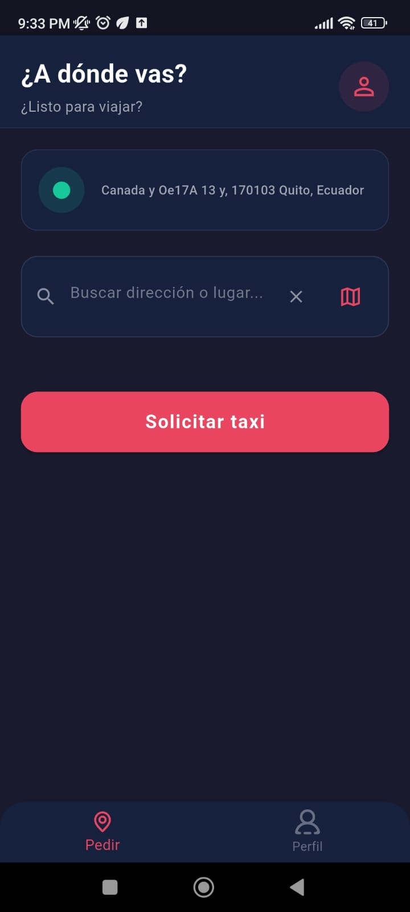
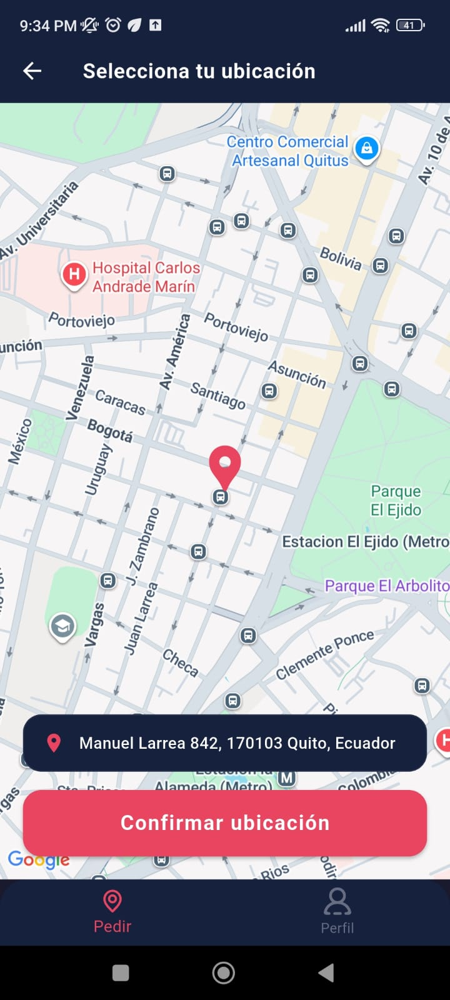
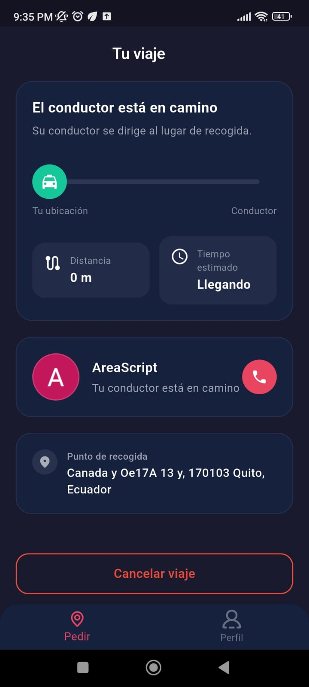
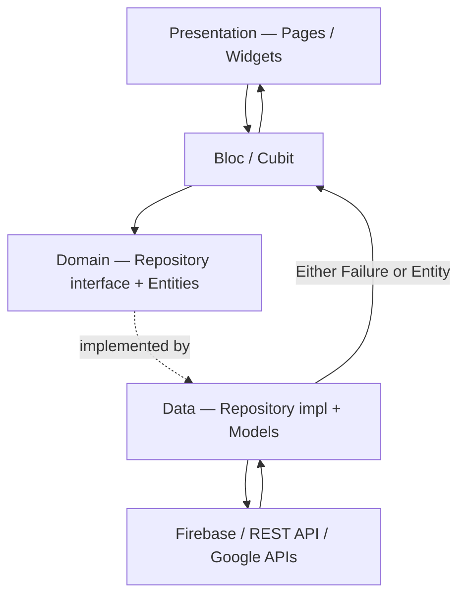
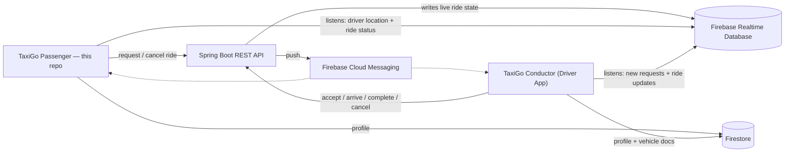

<div align="center">


# TaxiGo

**The passenger-side app of TaxiGo — a real-time taxi dispatch platform built for the city of Riobamba, Ecuador.**

[](https://flutter.dev)
[](https://dart.dev)
[](https://firebase.google.com)
[]()
[]()
[](https://github.com/areascript22/project-taxi-passenger/actions)
[]()

[Overview](#-overview) • [Screenshots](#-screenshots) • [Architecture](#-architecture) • [Tech Stack](#-tech-stack) • [Testing](#-testing) • [CI/CD](#-cicd) • [Getting Started](#-getting-started)

</div>

---

## 📖 Overview

**TaxiGo** is the rider-facing half of a two-sided, real-time taxi-hailing system: this app, a companion **[driver app](https://github.com/areascript22/project-taxi-driver)**, and a private **Spring Boot** backend, all wired together through **Firebase** for live data and push notifications.

Beyond the obvious "request a ride" flow, this app deals with the messy realities of a real dispatch product: **resuming an in-progress ride after the app was killed and reopened from a push notification**, **debounced address autocomplete**, **live driver-location tracking with distance/ETA**, and **graceful timeouts** when no driver is available — all backed by an automated test suite.

The app is live on Google Play (internal testing track), shipped through a fully automated CI/CD pipeline.

## 📱 Screenshots

<table>
<tr>
<td align="center"><br/><sub><b>Request a taxi</b></sub></td>
<td align="center"><br/><sub><b>Pick a location on the map</b></sub></td>
<td align="center"><br/><sub><b>Live ride tracking</b></sub></td>
</tr>
</table>

## ✨ Key Features

- 🔐 **Auth & session recovery** — Google Sign-In on top of Firebase Auth. On (re)launch, the session Bloc checks Firebase for an already-pending or in-progress ride and resumes the right screen automatically — including the race-prone case of the app being opened from a ride-related push notification.
- 📍 **Smart booking flow** — current-location detection, **debounced** Google Places Autocomplete search (`rxdart`-powered, no request spam while typing), and an interactive **Google Maps** picker to drop a pin manually.
- 🚕 **Ride requests with real feedback** — a "searching for driver" experience with a live countdown, an animated Lottie taxi, and an **automatic cancel after 30s** if no driver is found — no infinite spinners.
- 🛰️ **Live ride tracking** — real-time driver location and a distance/ETA indicator streamed from Firebase Realtime Database, with dedicated states/dialogs for driver-arrived, driver-cancelled and trip-completed.
- 🔔 **Push notifications + voice** — Firebase Cloud Messaging for ride updates, plus a spoken "thank you for riding with us" when a trip completes.
- 🌓 **Theming & preferences** — light/dark/system theme, voice and vibration toggles.
- ✅ **111 automated tests** (unit + Bloc) covering every business rule, success path, failure path and edge case.
- 🚀 **Automated release pipeline** — signed, flavored builds shipped straight to the Play Store.

## 🏗️ Architecture

The app follows a **feature-based Clean Architecture**, strictly layered and enforced by convention (see [`CLAUDE.md`](./CLAUDE.md) for the full internal style guide used while building this codebase):

```
UI  →  Bloc / Cubit  →  Repository / Service  →  Firebase · REST API · Google APIs
```

- **No `datasource` layer** — repositories/services talk to Firebase, the REST API or Google's HTTP APIs directly; there's no redundant indirection for its own sake.
- **Functional error handling** — every repository/service method returns `Future<Either<Failure, Entity>>` (via `dartz`). Exceptions never propagate up; they're caught, logged and converted to a typed `Failure`.
- **Model ↔ Entity separation** — `data/models` know how to (de)serialize; `domain/entities` are plain, framework-free business objects. The UI and Blocs never see a raw Model.
- **Dependency Injection** — each feature owns a `get_it` service locator (`init<Feature>DI`), registered independently, so features stay decoupled and easy to test in isolation.

<div align="center">



</div>

### The bigger picture

This app is one half of a real-time, two-sided marketplace:

<div align="center">



</div>

The Spring Boot API owns the source of truth for ride state transitions (request/accept/cancel/complete), which live server-side specifically to avoid race conditions between concurrently-connected drivers — Firebase Realtime Database is used purely for low-latency fan-out of state changes to both clients.

### Project structure

```
lib/
 ├─ core/            # Cross-cutting: network (Dio client), error types, theming, routing
 ├─ shared/          # Reusable across features: geolocation, geocoding, voice, vibration,
 │                    # notifications, session, settings, debouncer utility
 └─ features/
     ├─ auth/                 # Google Sign-In + session bootstrap
     ├─ passenger_profile/    # Passenger onboarding
     ├─ booking/              # Address search, pickup selection, ride request/cancel
     ├─ map/                  # Interactive map picker
     ├─ ride_tracking/        # Live driver tracking, arrival/cancel/completion dialogs
     └─ profile/              # Passenger profile management
         ├─ presentation/     # pages, widgets, bloc
         ├─ domain/           # entities, repository contracts
         ├─ data/             # repository implementation + models
         └─ di/               # feature-scoped service locator
```

## 🧰 Tech Stack

| Category | Technology |
|---|---|
| Language & Framework | Dart 3.7, Flutter 3.29 |
| State management | `flutter_bloc` / `bloc` (Bloc pattern only — no ad-hoc `setState`) |
| Dependency Injection | `get_it`, one locator per feature |
| Functional error handling | `dartz` (`Either<Failure, T>`) |
| Networking | `dio` + `dio_smart_retry` |
| Realtime data | `firebase_database` — live ride & driver-location state |
| Auth / Data / Storage | `firebase_auth`, `google_sign_in`, `cloud_firestore`, `firebase_storage` |
| Maps & places | `google_maps_flutter`, Google Places Autocomplete & Geocoding APIs (`rxdart` debounce) |
| Push notifications | `firebase_messaging`, `flutter_local_notifications` |
| Location | `geolocator` |
| Voice, haptics & animation | `flutter_tts`, `vibration`, `lottie` |
| Routing | `go_router` |
| Config | `flutter_dotenv` (per-flavor `.env`) |
| Testing | `flutter_test`, `bloc_test`, `mocktail` |
| CI/CD | GitHub Actions → Google Play (internal track) |

## ✅ Testing

The project ships with **111 automated tests** — pure unit tests for helpers (including the custom debounce `EventTransformer`) plus full `bloc_test` suites for every Bloc (`auth`, `booking`, `location_search`, `map_picker`, `passenger_onboarding`, `profile`, `ride_tracking`, `session`, `settings`, `location`), using **mocktail** to mock repositories and services.

Each Bloc is tested for its **initial state**, the **success path** (`Right`), the **failure path** (`Left(Failure)`), **guard clauses** that should make an event a no-op, and — where the Bloc listens to a `Stream` (Firebase Realtime Database) or debounces input (address search) — the **full sequence of emitted states**, including stream-error handling.

```bash
flutter test
```

## 🚀 CI/CD

Every push to the `qa` branch triggers a GitHub Actions pipeline that:

1. Decodes the flavor-specific `.env` file and `google-services.json` from encrypted secrets.
2. Restores the signing keystore and builds a **signed, flavored App Bundle** (`dev` / `prod` flavors, distinct `applicationId` per flavor).
3. Uploads the `.aab` straight to the **Google Play internal testing track**.

No manual build-and-upload step — a merge to `qa` is a release candidate on real devices within minutes.

## 🏁 Getting Started

```bash
git clone https://github.com/areascript22/project-taxi-passenger.git
cd project-taxi-passenger
flutter pub get
```

**1. Environment variables** — the app reads its backend and Google API keys from a per-flavor `.env` file (default path `assets/env/.env_dev`, overridable via `--dart-define=ENV_FILE=...`):

```env
BASE_URL=https://your-backend.example.com
PLACES_API_KEY=your-google-places-api-key
GEOCODING_API=your-google-geocoding-api-key
```

You'll also need a Google Maps API key for the native Android side (referenced as `mapsApiKey` in `android/app/build.gradle.kts` / `gradle.properties`).

**2. Firebase** — this repo doesn't ship `google-services.json` (it's injected by CI from a secret). To run locally, add your own Firebase Android config under `android/app/src/dev/google-services.json` (and `/prod` for the prod flavor) using [FlutterFire](https://firebase.flutter.dev/docs/cli/).

**3. Run:**

```bash
flutter run --flavor dev --dart-define=ENV_FILE=assets/env/.env_dev --dart-define=FLAVOR=dev
```

## 🔗 Related repositories

- 🚖 **[TaxiGo Conductor (Driver App)](https://github.com/areascript22/project-taxi-driver)** — the driver-facing Flutter app, same architecture.
- ☕ TaxiGo backend — a private Spring Boot REST API that owns ride-state transitions and drives Firebase fan-out.

---

<div align="center">

Built and maintained by **[@areascript22](https://github.com/areascript22)** — feel free to reach out.

</div>
